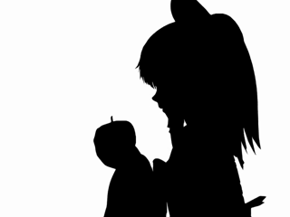
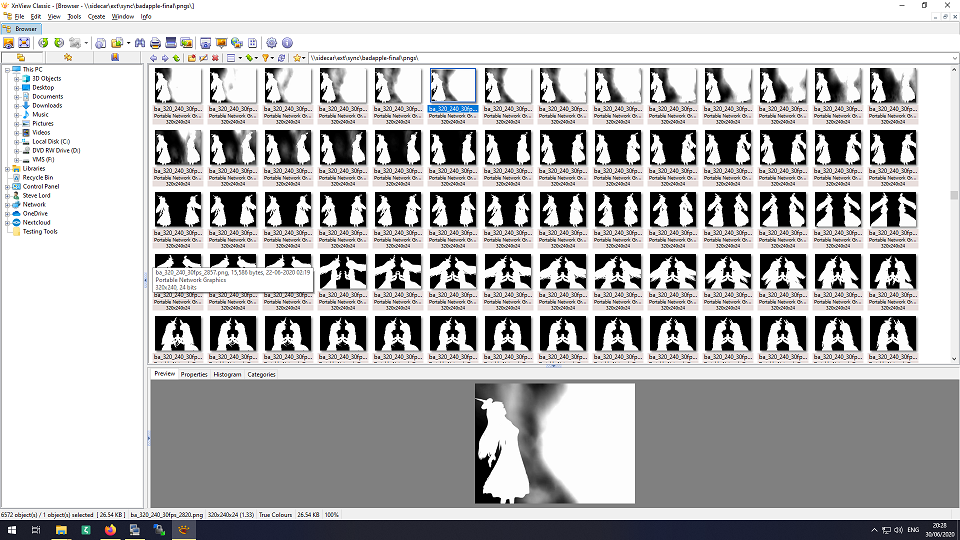

# U Mad, Apple? - Final Release
Bad Apple in Amiga Anim format, made entirely on a Commodore Amiga. Submitted to Novaparty 2020's Wild category, and now fixed up for release.

## Why?

Because there were Bad Apple Amiga ports on YouTube but I didn't find a wide public release. Someone did release a monochrome version but I couldn't find it until someone on a forum posted a link to it.

If you want to watch my version but don't have an Amiga handy, I've uploaded a capture to [Youtube](https://www.youtube.com/watch?v=aloO3jYbc0c). Both YouTube and my card mangled the capture. It looks better on an Amiga.

If you have an Amiga or emulator handy there are two final versions, anim5 and anim7l format. Try the anim5 one first.

## Will it play on an actual Amiga?

Yes. Specifically on my A4000 060/50. Takes a few minutes to load in, but it works. You'll need:

* About 64-128mb of RAM
* A fast CPU (060/50 is fine, 040 is probably as low as I'd go, I'd be keen to see if it works on an 030/50)
* Fast drives will reduce load times.
* You'll get more performance out of a minimal workbench or AmigaDos-only boot.

You can load the anims into ppaint, or any anim player but the sound will probably only play if you use [AnimFX](http://aminet.net/package/gfx/show/AnimFX).

## How is this special?

It's not. But it is a 320x256 video in 16 colours with 22030hz 2 channel sound and it plays while the OS is running. I entered a version in the Wild category at Novaparty 2020, reproduced it entirely on an Amiga and thought I'd write up instructions for anyone considering something similar.

## What is this process good for?

You get a higher framerate and smaller size than AGABlaster in exchange for much higher overheads. Early AVI formats may be better than this. You can probably go smaller still with MPEG. This is probably as low as you can go with more or less lossless video (the source vid used 16 colours) - there are audio losses of course in the conversion to 8-bit 22030hz.

If you have a realistic video, use [AGAConv](http://mschordan.github.io/amiga/agaconv.html) and [AGABlaster](http://mschordan.github.io/amiga/agablaster.html), MPEG-1 or Cinepak/Sorenson AVI. But this approach could be good for traditional cel drawn cartoons.

## What about glitches?

There were a lot of them along the way but most are gone. There's possible issues with the Paula chip and aliasing that should be mostly if not completely gone but there's a glitch in one part where parts of a halo flash. I haven't found a way to fix that. Most pro software (MAB, DPaint etc) can't handle anims this big and I've reached my limit as far as I want to go with this.

## How can I build my own?

If you just want to recreate the anim I've left all my images and sounds in the repo. Some parts take a day or two to run on an Amiga so you can skip bits and focus on what you're interested in. If you have an emulator with JIT enabled and a PC, you can put this together in about an hour. Progress, eh!

You will need:

* [ffmpeg](http://aminet.net/package/gfx/conv/ffmpeg-git7df9937-m68k)
* [sox](http://aminet.net/package/mus/play/sox-14.3.1-m68k)
* [animconvert](http://aminet.net/package/gfx/conv/AnimConvert)
* Fantasia by Moloch - This was on the EAB FTP, but that's down at the time of writing. I don't know if I can distribute my copy so I won't.
* [png2ilbm](http://bgafc.t-hosting.hu/prgv.php?p=2)
* [python](http://aminet.net/package/dev/gg/python2.4-m68k-amigaos)

Make some directories for sound, iffs, pngs and anims. Then, from a shell:

### Images

First we dump to PNG. This is worth checking before you proceed in case of glitches. I had some memory issues that really messed things up:

```ffmpeg -i apple-320.mp4 -r 30 pngs/ba_320_240_30fps_%04d.png```



We need to convert the images into a format for animconvert. Enter png2ilbm. However, png2ilbm only works on one file at a time. I've made a python script to generate a series of commands to be run through arexx.

Run the python script to dump out the Arexx script, then run Arexx on the script to generate ilbms with the right file extensions.

```
python png2ilbmgen.py > pnggen.rexx
rx pnggen.rexx
```


Now open up AnimConvert. Set your paths accordingly, and your images. Set the output to Anim5. Hit go, when ready.

### Sound

```
ffmpeg -i apple-320.mp4 -ac 2 -ar 22030 snd/badapple_2ch_22030_ffm.wav
sox -v 0.6 --multi-threaded -S -V -D snd/badapple_2ch_22030_ffm.wav -c 2 snd/badapple_2ch_22030_ffm.8svx rate 22030
```

### Putting it all together

Finally, fire up fantasia from the command line:

```
fantasia anims/ba_320_240_30fps.anim5 snd/badapple_2ch_22_5_-5db_ffm.8svx anims/badapple_final_anim5.sndanim
```

The resulting file should play in AnimFX.